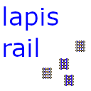

# Lapisrail, an Example Mod

## Setup

Refer to the excellent [fabric wiki page](https://fabricmc.net/wiki/tutorial:setup) and [example mod](https://github.com/FabricMC/fabric-example-mod) which this is based on.

## License

This example mod is available under the CC0 license. Feel free to learn from it and incorporate it in your own projects.

## Broad strokes

This mod introduces a new kind of rail called "lapisrail" which is made from cheap and plentiful lapis and is always powered! This was primarily a learning activity. Here's what's involved in making it work:

 * Getting a fabric mod dev template
 * Define general info about the mod
    * Name and version info in `src/main/resources/fabric.mod.json`, basically the root of things.
    * Thumbnail picture in `main/resources/assets/lapisrail/icon.png` 
 * Describing the new type of block, in all its orientations, and assigning textures to them:
    * `main/resources/assets/lapisrail/item/lapisrail.json` describes the block when its in your hand or in your inventory. Everything else is for the actual placed block.
    * `main/resources/assets/lapisrail/blockstates/lapisrail.json` is the root of all the different orientations a piece of rail can be in.
    * `main/resources/assets/lapisrail/models/block/*.json` these assign the texture to each orientation of rail given in `blockstates/lapisrail.json`.
    * `main/resources/assets/lapisrail/textures/block` these are the actual block texture graphics themselves.
 * Create a class for the new block type and register it with the game:
    * `main/java/com/github/lineartom/lapisrail/LapisRailBlock.java`
    * `main/java/com/github/lineartom/lapisrail/LapisRailMod.java`
 * Define a recipe for crafting such a rail!
    * `main/resources/data/lapisrail/recipes/lapisrail.json`

Then things get a little weird. In Minecraft, rails don't move minecarts. Minecarts choose for themselves whether to move by inspecting the type of rail they're on. This means we have to also:

 * Hotpatch the Java code for where a Minecart makes its move decisions. 
    * The patch goes in a Mixin at `lapisrail/mixin/MinecartMixin.java`
    * We register the fact we're using a Mixin with `main/resources/lapisrail.mixins.json`
    * Notice that this is happening on the server side. There is a similar mechanism for doing Mixins on the client side. Refer back to the Fabric Example Mod, which uses a client Mixin at `java/com/example/mixin/client/ExampleClientMixin.java`

On the client side, the only thing we need to do is this `BlockRenderLayerMap` business to properly extract and handle the transparent parts of our texture.

Like all powered rails, the lapisrails don't create curves.
